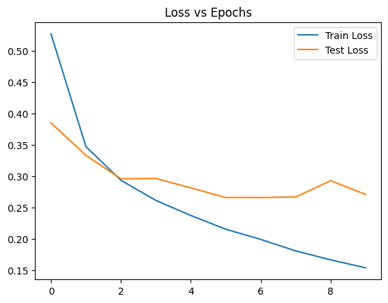
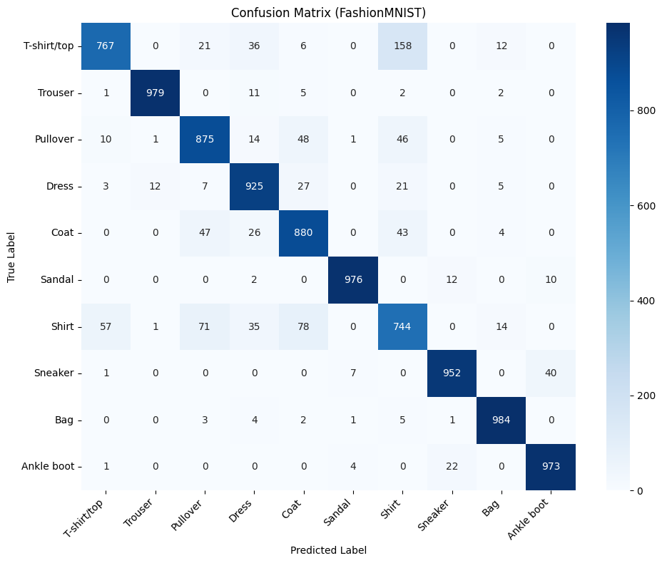
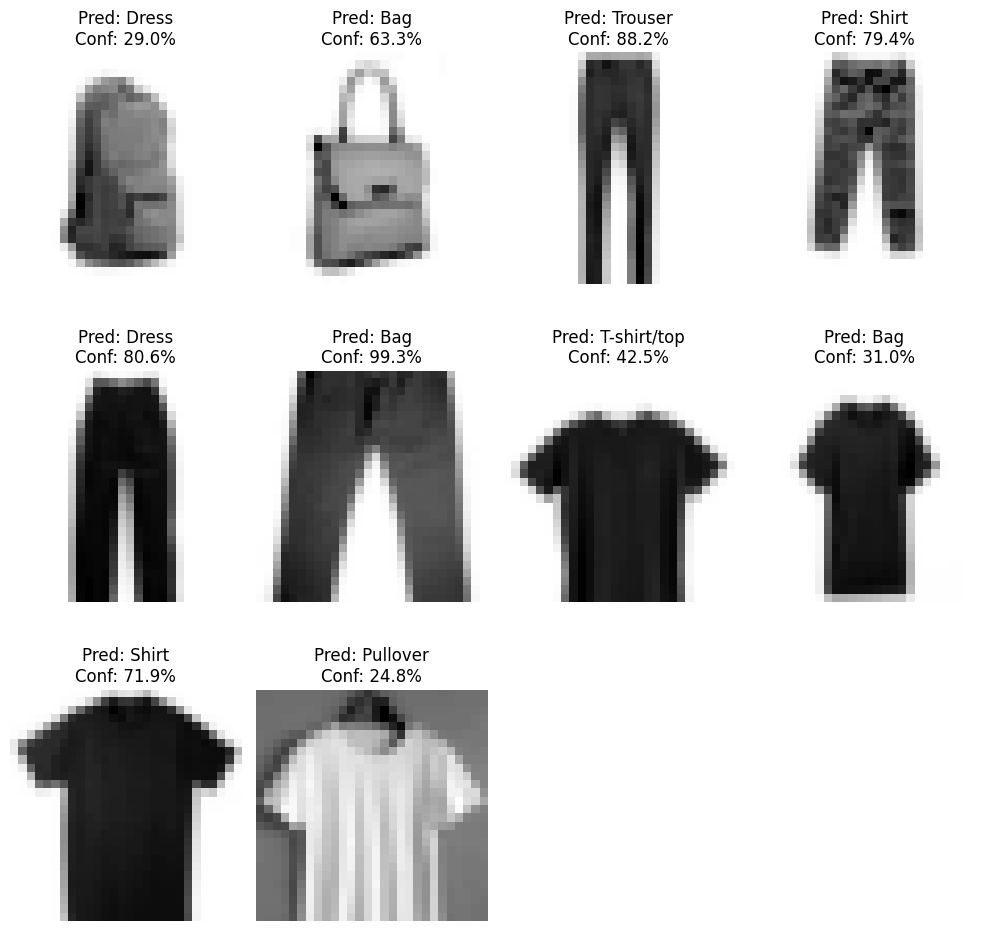
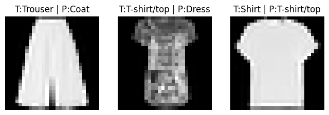

# fashion-cnn-210114
Machine Learning Assignment 
# 🧠 CNN Image Classification using FashionMNIST (PyTorch)

## 📌 Project Overview
This project implements a **Convolutional Neural Network (CNN)** using **PyTorch** to classify clothing items from the **FashionMNIST** dataset.  
In addition to standard benchmarking, the trained model is evaluated on **real-world smartphone images**, demonstrating how deep learning models generalize from curated datasets to practical environments.

The entire workflow is **fully automated and reproducible** using **Google Colab**, requiring **no manual file uploads** during execution.

---

## 📂 Dataset Description

### 1️⃣ Standard Dataset (Benchmark)

- **Name:** FashionMNIST  
- **Source:** `torchvision.datasets.FashionMNIST`  
- **Image Resolution:** 28 × 28 pixels  
- **Color Format:** Grayscale (1 channel)  
- **Number of Classes:** 10  

#### Class Labels

| Label | Class Name |
|------|-----------|
| 0 | T-shirt / Top |
| 1 | Trouser |
| 2 | Pullover |
| 3 | Dress |
| 4 | Coat |
| 5 | Sandal |
| 6 | Shirt |
| 7 | Sneaker |
| 8 | Bag |
| 9 | Ankle Boot |

---

### 2️⃣ Custom Real-World Images (Phone Dataset)

- **Total Images:** 10  
- **Captured Using:** Smartphone camera  
- **Objects:** T-shirt, Sneaker, Bag, Trouser, etc.  
- **Background:** Plain surface to reduce noise  
- **Storage Location:** `dataset/` directory  

All custom images are:
- Converted to **grayscale**
- Resized to **28 × 28 pixels**
- Normalized using the **same mean and standard deviation** as FashionMNIST
- Processed using the **exact same preprocessing pipeline** as training data

This ensures consistency between training and real-world inference.

---

## 📁 Repository Structure

  

---

## 🔄 Data Preprocessing
The following preprocessing steps are applied uniformly to **both standard and custom images**:

- Resize to **28 × 28**
- Convert to **grayscale**
- Normalize pixel values using dataset mean & standard deviation
- Convert to PyTorch tensors
- Reshape: `(28, 28)` → `(1, 28, 28)`

Consistent preprocessing is critical for reliable model performance.

---

## 🏗️ CNN Architecture

| Layer | Configuration |
|------|--------------|
| Conv2D | 32 filters, 3×3 kernel |
| ReLU | Activation |
| MaxPooling | 2×2 |
| Conv2D | 64 filters, 3×3 kernel |
| ReLU | Activation |
| MaxPooling | 2×2 |
| Fully Connected | 128 neurons |
| Output Layer | 10 classes |

**Training Setup**
- **Loss Function:** CrossEntropyLoss  
- **Optimizer:** Adam  
- **Framework:** PyTorch  

---

## 🚀 Model Training
- **Batch Size:** 64  
- **Epochs:** 5  
- **Metrics Tracked:** Training & validation loss, accuracy  
- **Visualization:** Loss and accuracy curves per epoch  

---

## 📊 Evaluation & Results

### ✔ Training Loss Curve

  

### ✔ Confusion Matrix (Test Set)

  

### ✔ Real-World Smartphone Predictions

  

### ✔ Visual Error Analysis (Incorrect Predictions)

  

---

## 📱 Real-World Prediction Pipeline
The trained CNN is evaluated on **custom smartphone images** by:

1. Loading images from the GitHub repository  
2. Applying the **same preprocessing pipeline** used during training  
3. Running inference in `.eval()` mode  
4. Applying **Softmax** to obtain class probabilities  

Each prediction includes:
- Predicted class label  
- Confidence percentage  

---

## 🔍 Model Observations & Analysis

- Very high confidence (**≈99–100%**) is observed for clean, well-aligned images, especially for **Bag** and **Sneaker**.
- Moderate confidence (**≈35–85%**) appears in visually similar classes such as **Pullover**, **Coat**, and **Dress**.
- Prediction confidence decreases with poor lighting, low contrast, or background noise.
- Despite being tra
